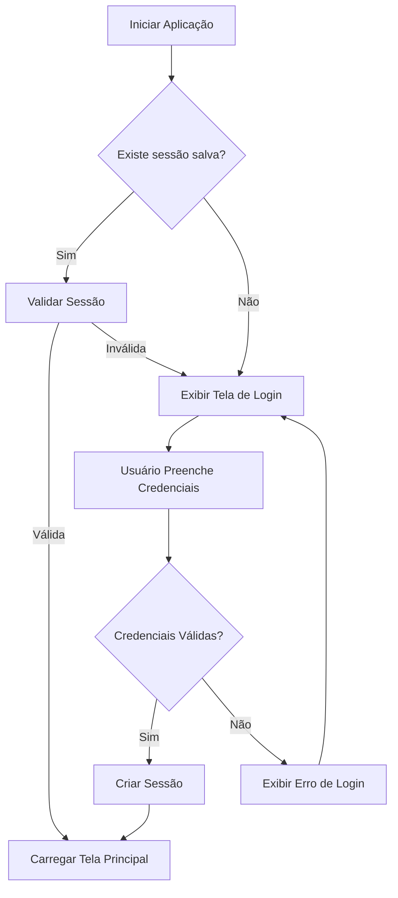
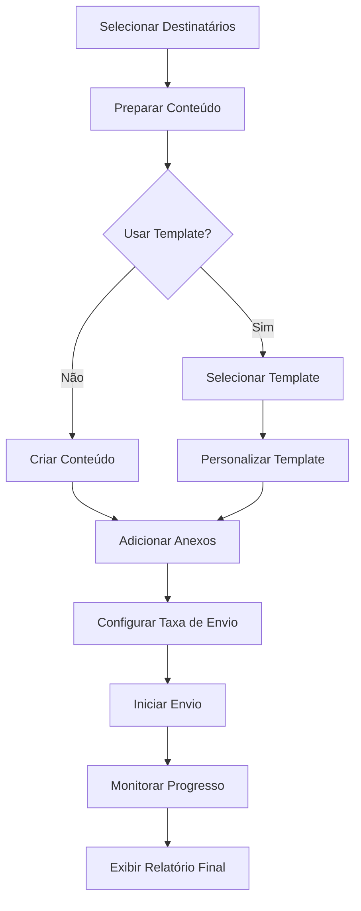
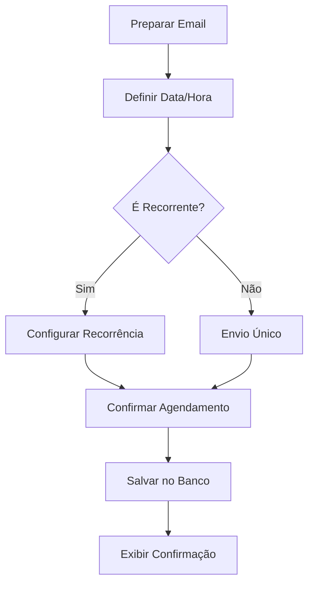

# Sistema de Envio de E-mails para Prefeituras
## Documentação Técnica Completa


## 📋 Sumário
- [Introdução](#-introdução)
- [Visão Geral do Sistema](#-visão-geral-do-sistema)
- [Arquitetura](#-arquitetura)
- [Configuração do Ambiente](#-configuração-do-ambiente)
- [Estrutura de Diretórios](#-estrutura-de-diretórios)
- [Banco de Dados](#-banco-de-dados)
  - [Estrutura do Banco](#estrutura-do-banco)
  - [Scripts de Manutenção](#scripts-de-manutenção)
  - [Gerenciamento de Usuários](#gerenciamento-de-usuários)
  - [Operações Comuns](#operações-comuns)
- [Interface Gráfica](#-interface-gráfica)
- [Módulos do Sistema](#-módulos-do-sistema)
- [Fluxos de Trabalho](#-fluxos-de-trabalho)
- [Segurança](#-segurança)
- [Testes e Qualidade](#-testes-e-qualidade)
- [Implantação](#-implantação)
- [Solução de Problemas](#-solução-de-problemas)
- [Referências](#-referências)
- [Apêndices](#-apêndices)

## 📖 Introdução

Esta documentação técnica é destinada aos desenvolvedores que trabalham na manutenção, extensão ou personalização do **Sistema de Envio de E-mails para Prefeituras**. Ela fornece detalhes sobre a arquitetura do sistema, componentes técnicos, banco de dados e procedimentos de desenvolvimento.

### Propósito do Sistema

O sistema foi desenvolvido para atender às necessidades específicas das Prefeituras de São José e Florianópolis, oferecendo uma solução integrada para a comunicação via e-mail institucional. Foi projetado para ser robusto, seguro e alinhado com as melhores práticas da administração pública.

### Público-Alvo da Documentação

Esta documentação é direcionada para:
- Desenvolvedores de software
- Administradores de banco de dados
- Equipe de suporte técnico
- Administradores de sistema

## 🌐 Visão Geral do Sistema

O **Sistema de Envio de E-mails para Prefeituras** é uma aplicação desktop Python com uma arquitetura modular. Suas principais funcionalidades incluem:

- Envio de e-mails individuais e em massa
- Agendamento de e-mails
- Gerenciamento de contatos e grupos
- Templates personalizáveis
- Relatórios de atividades
- Suporte a múltiplas prefeituras

## 🏗️ Arquitetura

O sistema segue uma arquitetura em camadas:

1. **Interface do Usuário (UI)**
   - Construída com Tkinter
   - Gerenciamento de janelas e diálogos
   - Renderização e interatividade

2. **Camada de Aplicação**
   - Lógica de negócios
   - Gerenciamento de sessão
   - Validação de dados

3. **Camada de Serviços**
   - Serviços de e-mail
   - Serviços de agendamento
   - Gerenciamento de templates

4. **Camada de Acesso a Dados**
   - Interação com o banco de dados SQLite
   - Operações CRUD
   - Caching e otimização

### Diagrama de Componentes

```
+------------------+     +------------------+     +------------------+
|  Interface (UI)  |     |  Controladores  |     |   Serviços      |
|                  |     |                  |     |                  |
|  - Janelas       |     |  - Validação     |     |  - EmailService  |
|  - Formulários   |<--->|  - Coordenação   |<--->|  - TemplateServ. |
|  - Visualizações |     |  - Eventos       |     |  - AgendaService |
+------------------+     +------------------+     +------------------+
                                 ^                       ^
                                 |                       |
                                 v                       v
                        +------------------+     +------------------+
                        |  Modelos (DTO)   |     |  Acesso a Dados  |
                        |                  |     |                  |
                        |  - Usuário       |<--->|  - DAO           |
                        |  - Email         |     |  - Conexão BD    |
                        |  - Template      |     |  - Consultas     |
                        +------------------+     +------------------+
```

## 🔧 Configuração do Ambiente

### Requisitos de Software

- Python 3.7 ou superior
- SQLite 3
- Bibliotecas Python conforme `requirements.txt`

### Instalação para Desenvolvimento

1. Clone o repositório do projeto:
   ```bash
   git clone https://github.com/prefeituras/sistema-email.git
   cd sistema-email
   ```

2. Crie e ative um ambiente virtual:
   ```bash
   python -m venv venv
   
   # No Windows
   venv\Scripts\activate
   
   # No Linux/Mac
   source venv/bin/activate
   ```

3. Instale as dependências:
   ```bash
   pip install -r requirements.txt
   ```

4. Execute o script de configuração:
   ```bash
   python setup.py
   ```

5. Inicialize o banco de dados (se necessário):
   ```bash
   python scripts/reset_database.py
   ```

### Execução em Modo de Desenvolvimento

Para iniciar o sistema em modo de desenvolvimento:

```bash
python run.py --debug
```

Flags disponíveis:
- `--debug`: Ativa logs detalhados e ferramentas de debug
- `--mock-smtp`: Simula envio de e-mails sem conectar ao servidor
- `--reset-config`: Restaura configurações padrão na inicialização
- `--port=XXXX`: Especifica a porta para o servidor de depuração

### Configuração do Editor

Recomendamos VSCode com as seguintes extensões:
- Python
- SQLite
- Code Spell Checker
- Python Docstring Generator

## 📁 Estrutura de Diretórios

```
sistema-email/
│
├── run.py                  # Ponto de entrada do aplicativo
├── sistema_email.py        # Classe principal do sistema
├── setup.py                # Script de instalação
├── requirements.txt        # Dependências do projeto
│
├── config/                 # Configurações do sistema
│   ├── __init__.py
│   ├── config_manager.py   # Gerenciador de configurações
│   └── defaults.py         # Valores padrão
│
├── database/               # Módulos de acesso a dados
│   ├── __init__.py
│   ├── connection.py       # Gerenciador de conexão
│   ├── dao/                # Objetos de acesso a dados
│   │   ├── __init__.py
│   │   ├── usuario_dao.py
│   │   ├── email_dao.py
│   │   └── ...
│   └── models/             # Definições de modelos
│       ├── __init__.py
│       ├── usuario.py
│       ├── email.py
│       └── ...
│
├── email/                  # Componentes relacionados a e-mail
│   ├── __init__.py
│   ├── sender.py           # Enviador de e-mails
│   ├── formatter.py        # Formatação de mensagens
│   └── templates/          # Templates HTML
│
├── gui/                    # Interface gráfica
│   ├── __init__.py
│   ├── app.py              # Aplicação principal
│   ├── frames/             # Componentes da interface
│   │   ├── __init__.py
│   │   ├── login_frame.py
│   │   ├── email_frame.py
│   │   └── ...
│   └── resources/          # Recursos visuais
│       ├── images/
│       └── styles/
│
├── scripts/                # Scripts utilitários
│   ├── reset_database.py   # Reset do banco de dados
│   ├── insert_admins.py    # Inserção de administradores
│   └── backup_manager.py   # Gerenciador de backups
│
├── utils/                  # Utilitários diversos
│   ├── __init__.py
│   ├── logging.py          # Configuração de logs
│   ├── validators.py       # Validadores de entrada
│   └── helpers.py          # Funções auxiliares
│
├── tests/                  # Testes automatizados
│   ├── __init__.py
│   ├── test_database.py    # Testes de banco de dados
│   ├── test_email.py       # Testes de envio de e-mail
│   └── ...
│
└── docs/                   # Documentação
    ├── developer/          # Guias para desenvolvedores
    ├── user/               # Manuais do usuário
    └── database/           # Documentação do banco de dados
```

## 🗃️ Banco de Dados

O sistema utiliza SQLite como banco de dados. O arquivo principal é `prefeituras_email.db` localizado na raiz do projeto.

### Estrutura do Banco

#### Tabela: `usuarios`

Armazena informações dos usuários do sistema.

| Campo | Tipo | Descrição |
|-------|------|-----------|
| id | INTEGER | Identificador único (PK) |
| nome | TEXT | Nome completo do usuário |
| email | TEXT | E-mail (único) |
| senha | TEXT | Hash SHA-256 da senha |
| prefeitura | TEXT | Código da prefeitura (sj/floripa) |
| cargo | TEXT | Cargo do usuário |
| departamento | TEXT | Departamento do usuário |
| telefone | TEXT | Telefone de contato |
| nivel_acesso | INTEGER | Nível de permissão (1=básico, 2=avançado, 3=admin) |
| data_cadastro | TIMESTAMP | Data de criação da conta |
| ultimo_acesso | TIMESTAMP | Data do último login |

**SQL de Criação:**
```sql
CREATE TABLE IF NOT EXISTS usuarios (
    id INTEGER PRIMARY KEY AUTOINCREMENT,
    nome TEXT NOT NULL,
    email TEXT NOT NULL UNIQUE,
    senha TEXT NOT NULL,
    prefeitura TEXT NOT NULL,
    cargo TEXT,
    departamento TEXT,
    telefone TEXT,
    nivel_acesso INTEGER NOT NULL DEFAULT 1,
    data_cadastro TIMESTAMP DEFAULT CURRENT_TIMESTAMP,
    ultimo_acesso TIMESTAMP
);
```

#### Tabela: `funcionarios`

Cadastro dos funcionários que podem receber e-mails.

| Campo | Tipo | Descrição |
|-------|------|-----------|
| id | INTEGER | Identificador único (PK) |
| nome | TEXT | Nome completo do funcionário |
| email | TEXT | E-mail (único) |
| cargo | TEXT | Cargo do funcionário |
| departamento | TEXT | Departamento do funcionário |
| telefone | TEXT | Telefone de contato |
| prefeitura | TEXT | Código da prefeitura (sj/floripa) |
| ativo | INTEGER | Status (0=inativo, 1=ativo) |

**SQL de Criação:**
```sql
CREATE TABLE IF NOT EXISTS funcionarios (
    id INTEGER PRIMARY KEY AUTOINCREMENT,
    nome TEXT NOT NULL,
    email TEXT NOT NULL UNIQUE,
    cargo TEXT,
    departamento TEXT,
    telefone TEXT,
    prefeitura TEXT NOT NULL,
    ativo INTEGER NOT NULL DEFAULT 1
);
```

#### Tabela: `grupos`

Grupos de distribuição de e-mails.

| Campo | Tipo | Descrição |
|-------|------|-----------|
| id | INTEGER | Identificador único (PK) |
| nome | TEXT | Nome do grupo |
| descricao | TEXT | Descrição do grupo |
| prefeitura | TEXT | Código da prefeitura (sj/floripa) |

**SQL de Criação:**
```sql
CREATE TABLE IF NOT EXISTS grupos (
    id INTEGER PRIMARY KEY AUTOINCREMENT,
    nome TEXT NOT NULL,
    descricao TEXT,
    prefeitura TEXT NOT NULL
);
```

#### Tabela: `grupo_funcionario`

Relacionamento entre grupos e funcionários (many-to-many).

| Campo | Tipo | Descrição |
|-------|------|-----------|
| grupo_id | INTEGER | ID do grupo (FK) |
| funcionario_id | INTEGER | ID do funcionário (FK) |

**SQL de Criação:**
```sql
CREATE TABLE IF NOT EXISTS grupo_funcionario (
    grupo_id INTEGER,
    funcionario_id INTEGER,
    PRIMARY KEY (grupo_id, funcionario_id),
    FOREIGN KEY (grupo_id) REFERENCES grupos (id),
    FOREIGN KEY (funcionario_id) REFERENCES funcionarios (id)
);
```

#### Tabela: `templates`

Modelos de e-mail personalizáveis.

| Campo | Tipo | Descrição |
|-------|------|-----------|
| id | INTEGER | Identificador único (PK) |
| nome | TEXT | Nome do template |
| assunto | TEXT | Assunto padrão do e-mail |
| conteudo | TEXT | Conteúdo HTML do e-mail |
| prefeitura | TEXT | Código da prefeitura |
| departamento | TEXT | Departamento relacionado |
| data_criacao | TIMESTAMP | Data de criação |
| ultima_modificacao | TIMESTAMP | Data da última edição |

**SQL de Criação:**
```sql
CREATE TABLE IF NOT EXISTS templates (
    id INTEGER PRIMARY KEY AUTOINCREMENT,
    nome TEXT NOT NULL,
    assunto TEXT NOT NULL,
    conteudo TEXT NOT NULL,
    prefeitura TEXT NOT NULL,
    departamento TEXT,
    data_criacao TIMESTAMP DEFAULT CURRENT_TIMESTAMP,
    ultima_modificacao TIMESTAMP DEFAULT CURRENT_TIMESTAMP
);
```

#### Tabela: `emails_enviados`

Registro de e-mails enviados.

| Campo | Tipo | Descrição |
|-------|------|-----------|
| id | INTEGER | Identificador único (PK) |
| usuario_id | INTEGER | ID do usuário que enviou (FK) |
| assunto | TEXT | Assunto do e-mail |
| conteudo | TEXT | Conteúdo HTML do e-mail |
| destinatarios | TEXT | Lista de destinatários (JSON) |
| data_envio | TIMESTAMP | Data e hora do envio |
| status | TEXT | Status do envio (enviado, falha) |

**SQL de Criação:**
```sql
CREATE TABLE IF NOT EXISTS emails_enviados (
    id INTEGER PRIMARY KEY AUTOINCREMENT,
    usuario_id INTEGER NOT NULL,
    assunto TEXT NOT NULL,
    conteudo TEXT NOT NULL,
    destinatarios TEXT NOT NULL,
    data_envio TIMESTAMP DEFAULT CURRENT_TIMESTAMP,
    status TEXT NOT NULL,
    FOREIGN KEY (usuario_id) REFERENCES usuarios (id)
);
```

#### Tabela: `emails_agendados`

E-mails programados para envio futuro.

| Campo | Tipo | Descrição |
|-------|------|-----------|
| id | INTEGER | Identificador único (PK) |
| usuario_id | INTEGER | ID do usuário que agendou (FK) |
| assunto | TEXT | Assunto do e-mail |
| conteudo | TEXT | Conteúdo HTML do e-mail |
| destinatarios | TEXT | Lista de destinatários (JSON) |
| data_agendada | TIMESTAMP | Data e hora programada |
| recorrencia | TEXT | Tipo de recorrência |
| anexos | TEXT | Lista de anexos (JSON) |
| recorrencia_opcoes | TEXT | Opções de recorrência (JSON) |
| status | TEXT | Status (pendente, enviado, cancelado) |

**SQL de Criação:**
```sql
CREATE TABLE IF NOT EXISTS emails_agendados (
    id INTEGER PRIMARY KEY AUTOINCREMENT,
    usuario_id INTEGER NOT NULL,
    assunto TEXT NOT NULL,
    conteudo TEXT NOT NULL,
    destinatarios TEXT NOT NULL,
    data_agendada TIMESTAMP NOT NULL,
    recorrencia TEXT,
    anexos TEXT,
    recorrencia_opcoes TEXT,
    status TEXT NOT NULL DEFAULT 'pendente',
    FOREIGN KEY (usuario_id) REFERENCES usuarios (id)
);
```

#### Tabela: `logs`

Registro de atividades do sistema.

| Campo | Tipo | Descrição |
|-------|------|-----------|
| id | INTEGER | Identificador único (PK) |
| usuario_id | INTEGER | ID do usuário relacionado (FK, pode ser NULL) |
| acao | TEXT | Tipo de ação realizada |
| descricao | TEXT | Descrição detalhada da ação |
| data | TIMESTAMP | Data e hora do registro |

**SQL de Criação:**
```sql
CREATE TABLE IF NOT EXISTS logs (
    id INTEGER PRIMARY KEY AUTOINCREMENT,
    usuario_id INTEGER,
    acao TEXT NOT NULL,
    descricao TEXT,
    data TIMESTAMP DEFAULT CURRENT_TIMESTAMP,
    FOREIGN KEY (usuario_id) REFERENCES usuarios (id)
);
```

### Scripts de Manutenção

O sistema inclui vários scripts para manutenção do banco de dados:

#### Script: `reset_database.py`

Este script reinicia o banco de dados para o estado inicial. Use com extrema cautela, pois todos os dados serão apagados.

**Funcionalidades:**
- Cria backup automático antes de reset
- Remove todas as tabelas existentes
- Recria a estrutura do banco de dados
- Restaura configurações padrão
- Cria usuário administrador padrão

**Implementação Detalhada:**

1. **Função `criar_backup_antes_de_resetar()`**
   - Verifica se o banco de dados existe
   - Cria diretório de backup se não existir
   - Gera nome único com timestamp
   - Copia arquivo do banco com `shutil.copy2()`

2. **Função `restaurar_configuracoes_padrao()`**
   - Define configurações padrão em um dicionário
   - Cria diretório de configuração se necessário
   - Salva configurações em formato JSON

3. **Função `resetar_banco_dados()`**
   - Remove banco de dados existente
   - Cria nova conexão SQLite
   - Define esquema de tabelas com comandos SQL
   - Cria usuário administrador padrão
   - Registra ação nos logs

4. **Função `limpar_anexos_agendados()`**
   - Remove e recria o diretório de anexos

5. **Função `main()`**
   - Solicita confirmação do usuário
   - Chama as funções em sequência
   - Exibe mensagens de status

**Como usar:**
```bash
python scripts/reset_database.py
```

**Fluxo de execução:**
1. Exibe aviso e solicita confirmação
2. Cria backup do banco atual
3. Restaura configurações padrão
4. Recria o banco de dados do zero
5. Limpa pasta de anexos agendados
6. Exibe credenciais de administrador

#### Script: `insert_admins.py`

Insere ou atualiza os usuários administradores para cada prefeitura.

**Funcionalidades:**
- Cria administrador para São José (admin.sj@saojose.sc.gov.br)
- Cria administrador para Florianópolis (admin.floripa@pmf.sc.gov.br)
- Atualiza senhas caso os usuários já existam

**Implementação Detalhada:**

1. **Definição do banco de dados**
   - Define caminho para o arquivo SQLite

2. **Função `inserir_administradores()`**
   - Verifica existência do banco de dados
   - Estabelece conexão SQLite
   - Verifica se a tabela 'usuarios' existe
   - Define senhas específicas para cada prefeitura
   - Gera hash SHA-256 das senhas
   - Verifica se os administradores já existem
   - Atualiza senhas ou insere novos registros
   - Exibe informações de confirmação

3. **Bloco principal**
   - Exibe cabeçalho
   - Chama função de inserção
   - Aguarda confirmação do usuário

**Como usar:**
```bash
python scripts/insert_admins.py
```

**Detalhes técnicos:**
- As senhas são armazenadas com hash SHA-256
- As credenciais padrão são:
  - São José: admin.sj@saojose.sc.gov.br / admin@sj123
  - Florianópolis: admin.floripa@pmf.sc.gov.br / admin@fpolis2505
- Nível de acesso 3 (administrador)

### Gerenciamento de Usuários

#### Níveis de Acesso

O sistema implementa três níveis de acesso:

1. **Nível 1 (Básico)**
   - Envio de e-mails individuais
   - Consulta de contatos
   - Uso de templates existentes

2. **Nível 2 (Avançado)**
   - Todas as permissões do Nível 1
   - Envio de e-mails em massa
   - Agendamento de e-mails
   - Criação e edição de templates
   - Gerenciamento de grupos

3. **Nível 3 (Administrador)**
   - Todas as permissões do Nível 2
   - Gerenciamento de usuários
   - Configurações do sistema
   - Backup e restauração
   - Visualização de logs

#### Operações de Autenticação

A autenticação é implementada com hash SHA-256:

```python
import hashlib

def gerar_hash_senha(senha):
    """Gera um hash SHA-256 para a senha fornecida."""
    return hashlib.sha256(senha.encode()).hexdigest()

def verificar_senha(senha_fornecida, hash_armazenado):
    """Verifica se a senha fornecida corresponde ao hash armazenado."""
    hash_fornecido = hashlib.sha256(senha_fornecida.encode()).hexdigest()
    return hash_fornecido == hash_armazenado
```

#### Exemplo de Adição de Usuário

```python
def adicionar_usuario(conn, nome, email, senha, prefeitura, cargo=None, 
                     departamento=None, telefone=None, nivel_acesso=1):
    """Adiciona um novo usuário ao banco de dados."""
    cursor = conn.cursor()
    
    # Gera hash da senha
    senha_hash = hashlib.sha256(senha.encode()).hexdigest()
    
    # Insere o usuário
    cursor.execute('''
    INSERT INTO usuarios (nome, email, senha, prefeitura, cargo, 
                         departamento, telefone, nivel_acesso)
    VALUES (?, ?, ?, ?, ?, ?, ?, ?)
    ''', (nome, email, senha_hash, prefeitura, cargo, 
         departamento, telefone, nivel_acesso))
    
    # Salva as alterações
    conn.commit()
    
    return cursor.lastrowid
```

### Operações Comuns

Aqui estão alguns exemplos de operações comuns no banco de dados:

#### Buscar Usuário por Email

```python
def buscar_usuario_por_email(conn, email):
    """Busca um usuário pelo email."""
    cursor = conn.cursor()
    cursor.execute("SELECT * FROM usuarios WHERE email = ?", (email,))
    return cursor.fetchone()
```

#### Obter Todos os Funcionários de uma Prefeitura

```python
def obter_funcionarios_por_prefeitura(conn, prefeitura, ativos_apenas=True):
    """Retorna todos os funcionários de uma prefeitura."""
    cursor = conn.cursor()
    
    sql = "SELECT * FROM funcionarios WHERE prefeitura = ?"
    params = [prefeitura]
    
    if ativos_apenas:
        sql += " AND ativo = 1"
    
    cursor.execute(sql, params)
    return cursor.fetchall()
```

#### Registrar Envio de Email

```python
def registrar_email_enviado(conn, usuario_id, assunto, conteudo, 
                          destinatarios, status="enviado"):
    """Registra um email enviado no histórico."""
    cursor = conn.cursor()
    
    # Converte lista de destinatários para JSON se necessário
    if isinstance(destinatarios, list):
        import json
        destinatarios = json.dumps(destinatarios)
    
    cursor.execute('''
    INSERT INTO emails_enviados 
    (usuario_id, assunto, conteudo, destinatarios, status)
    VALUES (?, ?, ?, ?, ?)
    ''', (usuario_id, assunto, conteudo, destinatarios, status))
    
    conn.commit()
    return cursor.lastrowid
```

#### Obter Membros de um Grupo

```python
def obter_membros_grupo(conn, grupo_id):
    """Retorna todos os funcionários de um grupo específico."""
    cursor = conn.cursor()
    cursor.execute('''
    SELECT f.* FROM funcionarios f
    JOIN grupo_funcionario gf ON f.id = gf.funcionario_id
    WHERE gf.grupo_id = ? AND f.ativo = 1
    ''', (grupo_id,))
    return cursor.fetchall()
```

## 🖥️ Interface Gráfica

O sistema utiliza Tkinter para a interface gráfica, organizada em módulos reutilizáveis.

### Estrutura de Classes

```
BaseFrame (Abstrata)
  ├── LoginFrame
  ├── MainFrame
  │     ├── EmailIndividualTab
  │     ├── EmailMassaTab
  │     ├── AgendamentoTab
  │     ├── TemplatesTab
  │     ├── FuncionariosTab
  │     ├── ConfiguracoesTab
  │     └── LogsTab
  ├── ConfigDialog
  └── HelpDialog
```

### Temas e Estilos

O sistema implementa temas personalizados para cada prefeitura:

```python
# Exemplo de configuração de tema para São José
def aplicar_tema_sj(self):
    """Aplica o tema visual da Prefeitura de São José."""
    self.cores = {
        'primaria': '#003366',        # Azul escuro
        'secundaria': '#0066cc',      # Azul médio
        'texto': '#333333',           # Cinza escuro para texto
        'fundo': '#f5f5f5',           # Cinza claro para fundo
        'destaque': '#ff9900',        # Laranja para destaque
        'erro': '#cc3300',            # Vermelho para erros
        'sucesso': '#339900',         # Verde para sucesso
    }
    
    # Aplica o tema nos widgets
    self.style.configure('TFrame', background=self.cores['fundo'])
    self.style.configure('TLabel', background=self.cores['fundo'], 
                         foreground=self.cores['texto'])
    self.style.configure('TButton', background=self.cores['secundaria'], 
                         foreground='white')
    # ... mais configurações
```

### Recursos de Acessibilidade

A interface implementa recursos de acessibilidade:
- Teclas de atalho para funções principais
- Suporte a alto contraste
- Tamanhos de fonte ajustáveis
- Tooltips descritivos

```python
# Exemplo de implementação de atalhos de teclado
def configurar_atalhos(self):
    """Configura atalhos de teclado."""
    self.root.bind('<Control-n>', lambda e: self.novo_email())
    self.root.bind('<Control-s>', lambda e: self.salvar_rascunho())
    self.root.bind('<F1>', lambda e: self.exibir_ajuda())
    # ... mais atalhos
```

## 📦 Módulos do Sistema (continuação)

### Módulo de Envio de E-mails (continuação)

```python
    def _adicionar_anexo(self, msg, caminho_arquivo):
        """Adiciona um anexo à mensagem."""
        with open(caminho_arquivo, 'rb') as arquivo:
            part = MIMEBase('application', 'octet-stream')
            part.set_payload(arquivo.read())
        
        encoders.encode_base64(part)
        
        # Adiciona cabeçalho com nome do arquivo
        nome_arquivo = os.path.basename(caminho_arquivo)
        part.add_header(
            'Content-Disposition',
            f'attachment; filename= {nome_arquivo}'
        )
        
        msg.attach(part)
    
    def enviar_email_massa(self, de, lista_para, assunto, corpo_template, 
                          dados_personalizacao=None, prefeitura='sj', 
                          limite_hora=100, intervalo_segundos=5):
        """
        Envia e-mails em massa com personalização.
        
        Args:
            de: E-mail do remetente
            lista_para: Lista de e-mails dos destinatários
            assunto: Assunto do e-mail
            corpo_template: Template HTML do corpo do e-mail
            dados_personalizacao: Dicionário com dados para personalização
            prefeitura: Código da prefeitura
            limite_hora: Limite de e-mails por hora
            intervalo_segundos: Intervalo entre envios
            
        Returns:
            Tupla (sucesso, mensagem, detalhes)
        """
        resultados = {
            'sucesso': 0,
            'falha': 0,
            'detalhes': []
        }
        
        total_envios = len(lista_para)
        self.logger.info(f"Iniciando envio em massa para {total_envios} destinatários")
        
        # Verifica limites
        if total_envios > limite_hora:
            self.logger.warning(f"Total de envios ({total_envios}) excede limite por hora ({limite_hora})")
        
        try:
            # Conecta uma única vez para múltiplos envios
            server = self.conectar_smtp(prefeitura)
            
            for i, destinatario in enumerate(lista_para):
                try:
                    # Personaliza o corpo para cada destinatário
                    corpo_personalizado = self._personalizar_corpo(
                        corpo_template, 
                        destinatario,
                        dados_personalizacao
                    )
                    
                    # Cria mensagem
                    msg = MIMEMultipart()
                    msg['From'] = de
                    msg['To'] = destinatario
                    msg['Subject'] = assunto
                    
                    # Adiciona corpo da mensagem
                    msg.attach(MIMEText(corpo_personalizado, 'html'))
                    
                    # Envia
                    server.send_message(msg)
                    
                    # Registra sucesso
                    resultados['sucesso'] += 1
                    resultados['detalhes'].append({
                        'email': destinatario,
                        'status': 'enviado',
                        'mensagem': 'Enviado com sucesso'
                    })
                    
                    # Aguarda intervalo entre envios
                    if i < total_envios - 1:  # Não aguarda após o último
                        time.sleep(intervalo_segundos)
                        
                except Exception as e:
                    # Registra falha
                    resultados['falha'] += 1
                    resultados['detalhes'].append({
                        'email': destinatario,
                        'status': 'falha',
                        'mensagem': str(e)
                    })
                    self.logger.error(f"Erro ao enviar para {destinatario}: {str(e)}")
                    
                # Verifica se precisamos reconectar devido a timeout
                if i > 0 and i % 20 == 0:
                    try:
                        server.quit()
                        server = self.conectar_smtp(prefeitura)
                    except:
                        server = self.conectar_smtp(prefeitura)
            
            server.quit()
            
            # Log final
            self.logger.info(f"Envio em massa concluído: {resultados['sucesso']} enviados, "
                           f"{resultados['falha']} falhas")
            
            mensagem = (f"Envio concluído. {resultados['sucesso']} e-mails enviados, "
                      f"{resultados['falha']} falhas.")
            
            return True, mensagem, resultados
            
        except Exception as e:
            mensagem = f"Erro geral no envio em massa: {str(e)}"
            self.logger.error(mensagem)
            return False, mensagem, resultados
    
    def _personalizar_corpo(self, template, email_destinatario, dados=None):
        """
        Personaliza o corpo do e-mail substituindo variáveis por valores.
        
        Args:
            template: String com o template HTML
            email_destinatario: E-mail do destinatário
            dados: Dicionário com dados para substituição
            
        Returns:
            Template HTML com variáveis substituídas
        """
        corpo = template
        
        # Se não temos dados de personalização, retorna template original
        if not dados or email_destinatario not in dados:
            return corpo
            
        # Obtém dados do destinatário
        dados_destinatario = dados.get(email_destinatario, {})
        
        # Substitui variáveis pelos valores
        for chave, valor in dados_destinatario.items():
            placeholder = '{' + chave + '}'
            corpo = corpo.replace(placeholder, str(valor))
            
        return corpo
```

### Módulo de Agendamento

Gerencia e executa e-mails agendados:

```python
class AgendamentoManager:
    """Gerencia e executa e-mails agendados."""
    
    def __init__(self, db_connection, email_sender, config):
        """
        Inicializa o gerenciador de agendamento.
        
        Args:
            db_connection: Conexão com o banco de dados
            email_sender: Instância de EmailSender para envio
            config: Configurações do sistema
        """
        self.conn = db_connection
        self.email_sender = email_sender
        self.config = config
        self.logger = logging.getLogger('agendamento')
        self.rodando = False
        self.thread = None
    
    def agendar_email(self, usuario_id, assunto, conteudo, destinatarios, 
                    data_agendada, recorrencia=None, anexos=None, 
                    recorrencia_opcoes=None):
        """
        Agenda um novo e-mail para envio futuro.
        
        Args:
            usuario_id: ID do usuário que agendou
            assunto: Assunto do e-mail
            conteudo: Corpo HTML do e-mail
            destinatarios: Lista ou string de destinatários
            data_agendada: Data e hora para envio (formato ISO)
            recorrencia: Tipo de recorrência (diaria, semanal, mensal, None)
            anexos: Lista de caminhos de anexos
            recorrencia_opcoes: Opções específicas de recorrência
            
        Returns:
            ID do agendamento criado
        """
        cursor = self.conn.cursor()
        
        # Converte listas para JSON
        if isinstance(destinatarios, list):
            destinatarios = json.dumps(destinatarios)
        
        if isinstance(anexos, list):
            # Copia anexos para diretório seguro
            anexos_salvos = self._salvar_anexos(anexos)
            anexos = json.dumps(anexos_salvos)
        elif anexos is None:
            anexos = json.dumps([])
        
        if isinstance(recorrencia_opcoes, dict):
            recorrencia_opcoes = json.dumps(recorrencia_opcoes)
        
        # Insere no banco de dados
        cursor.execute('''
        INSERT INTO emails_agendados (
            usuario_id, assunto, conteudo, destinatarios, 
            data_agendada, recorrencia, anexos, 
            recorrencia_opcoes, status
        ) VALUES (?, ?, ?, ?, ?, ?, ?, ?, ?)
        ''', (
            usuario_id, assunto, conteudo, destinatarios,
            data_agendada, recorrencia, anexos,
            recorrencia_opcoes, 'pendente'
        ))
        
        self.conn.commit()
        agendamento_id = cursor.lastrowid
        
        self.logger.info(f"E-mail agendado (ID: {agendamento_id}) para {data_agendada}")
        return agendamento_id
    
    def _salvar_anexos(self, lista_anexos):
        """
        Salva anexos em diretório seguro para agendamento.
        
        Args:
            lista_anexos: Lista de caminhos originais
            
        Returns:
            Lista de novos caminhos
        """
        diretorio = os.path.join(
            os.path.dirname(os.path.dirname(os.path.abspath(__file__))),
            'anexos_agendados'
        )
        
        # Garante que o diretório existe
        os.makedirs(diretorio, exist_ok=True)
        
        novos_caminhos = []
        
        for anexo in lista_anexos:
            if os.path.exists(anexo):
                # Gera nome único para o arquivo
                nome_arquivo = os.path.basename(anexo)
                timestamp = int(time.time())
                nome_unico = f"{timestamp}_{nome_arquivo}"
                novo_caminho = os.path.join(diretorio, nome_unico)
                
                # Copia o arquivo
                shutil.copy2(anexo, novo_caminho)
                novos_caminhos.append(novo_caminho)
        
        return novos_caminhos
    
    def iniciar_servico(self):
        """Inicia o serviço de verificação e execução de agendamentos."""
        if self.rodando:
            return
        
        self.rodando = True
        self.thread = threading.Thread(target=self._loop_verificacao)
        self.thread.daemon = True
        self.thread.start()
        
        self.logger.info("Serviço de agendamento iniciado")
    
    def parar_servico(self):
        """Para o serviço de verificação de agendamentos."""
        self.rodando = False
        if self.thread:
            self.thread.join(timeout=5)
        self.logger.info("Serviço de agendamento parado")
    
    def _loop_verificacao(self):
        """Loop principal de verificação de e-mails agendados."""
        while self.rodando:
            try:
                self._verificar_agendamentos()
            except Exception as e:
                self.logger.error(f"Erro no serviço de agendamento: {str(e)}")
            
            # Aguarda um minuto até próxima verificação
            time.sleep(60)
    
    def _verificar_agendamentos(self):
        """Verifica e envia e-mails agendados pendentes."""
        cursor = self.conn.cursor()
        
        # Obtém data atual
        data_atual = datetime.datetime.now().isoformat()
        
        # Busca agendamentos pendentes que já deveriam ter sido enviados
        cursor.execute('''
        SELECT * FROM emails_agendados
        WHERE status = 'pendente' AND data_agendada <= ?
        ''', (data_atual,))
        
        agendamentos = cursor.fetchall()
        
        for agendamento in agendamentos:
            self._processar_agendamento(agendamento)
    
    def _processar_agendamento(self, agendamento):
        """Processa um agendamento específico."""
        try:
            agendamento_id = agendamento['id']
            self.logger.info(f"Processando agendamento {agendamento_id}")
            
            # Obtém detalhes do usuário
            cursor = self.conn.cursor()
            cursor.execute('''
            SELECT * FROM usuarios WHERE id = ?
            ''', (agendamento['usuario_id'],))
            usuario = cursor.fetchone()
            
            if not usuario:
                raise Exception(f"Usuário ID {agendamento['usuario_id']} não encontrado")
            
            # Prepara destinatários
            destinatarios = json.loads(agendamento['destinatarios'])
            
            # Prepara anexos
            anexos = json.loads(agendamento['anexos'])
            
            # Envia o e-mail
            resultado, mensagem = self.email_sender.enviar_email(
                de=usuario['email'],
                para=destinatarios,
                assunto=agendamento['assunto'],
                corpo=agendamento['conteudo'],
                anexos=anexos,
                prefeitura=usuario['prefeitura']
            )
            
            # Atualiza status do agendamento
            self._atualizar_status_agendamento(
                agendamento_id,
                'enviado' if resultado else 'falha',
                mensagem
            )
            
            # Se tem recorrência, agenda próximo envio
            if agendamento['recorrencia']:
                self._agendar_recorrencia(agendamento)
            
        except Exception as e:
            self.logger.error(f"Erro ao processar agendamento {agendamento['id']}: {str(e)}")
            self._atualizar_status_agendamento(agendamento['id'], 'falha', str(e))
    
    def _atualizar_status_agendamento(self, agendamento_id, status, mensagem=None):
        """Atualiza o status de um agendamento."""
        cursor = self.conn.cursor()
        
        sql = "UPDATE emails_agendados SET status = ? WHERE id = ?"
        params = [status, agendamento_id]
        
        cursor.execute(sql, params)
        self.conn.commit()
        
        # Registra log
        acao = f"AGENDAMENTO_{status.upper()}"
        descricao = f"Agendamento ID {agendamento_id}: {mensagem}" if mensagem else None
        
        cursor.execute('''
        INSERT INTO logs (acao, descricao) VALUES (?, ?)
        ''', (acao, descricao))
        
        self.conn.commit()
    
    def _agendar_recorrencia(self, agendamento):
        """Cria um novo agendamento baseado na recorrência."""
        tipo_recorrencia = agendamento['recorrencia']
        opcoes = json.loads(agendamento['recorrencia_opcoes'] or '{}')
        
        # Calcula próxima data baseada no tipo de recorrência
        data_original = datetime.datetime.fromisoformat(agendamento['data_agendada'])
        proxima_data = None
        
        if tipo_recorrencia == 'diaria':
            dias = opcoes.get('intervalo_dias', 1)
            proxima_data = data_original + datetime.timedelta(days=dias)
            
        elif tipo_recorrencia == 'semanal':
            semanas = opcoes.get('intervalo_semanas', 1)
            proxima_data = data_original + datetime.timedelta(weeks=semanas)
            
        elif tipo_recorrencia == 'mensal':
            meses = opcoes.get('intervalo_meses', 1)
            
            # Adiciona meses (lógica simplificada)
            ano = data_original.year
            mes = data_original.month + meses
            
            # Ajusta ano se necessário
            while mes > 12:
                mes -= 12
                ano += 1
                
            dia = min(data_original.day, calendar.monthrange(ano, mes)[1])
            
            proxima_data = data_original.replace(
                year=ano,
                month=mes,
                day=dia
            )
        
        if proxima_data:
            # Cria novo agendamento
            self.agendar_email(
                usuario_id=agendamento['usuario_id'],
                assunto=agendamento['assunto'],
                conteudo=agendamento['conteudo'],
                destinatarios=agendamento['destinatarios'],
                data_agendada=proxima_data.isoformat(),
                recorrencia=tipo_recorrencia,
                anexos=agendamento['anexos'],
                recorrencia_opcoes=agendamento['recorrencia_opcoes']
            )
```

### Módulo de Templates

Gerencia templates de e-mail:

```python
class TemplateManager:
    """Gerencia templates de e-mail."""
    
    def __init__(self, db_connection):
        """
        Inicializa o gerenciador de templates.
        
        Args:
            db_connection: Conexão com o banco de dados
        """
        self.conn = db_connection
        self.logger = logging.getLogger('templates')
    
    def criar_template(self, nome, assunto, conteudo, prefeitura, departamento=None):
        """
        Cria um novo template de e-mail.
        
        Args:
            nome: Nome do template
            assunto: Assunto padrão do e-mail
            conteudo: Conteúdo HTML do template
            prefeitura: Código da prefeitura
            departamento: Departamento relacionado (opcional)
            
        Returns:
            ID do template criado
        """
        cursor = self.conn.cursor()
        
        cursor.execute('''
        INSERT INTO templates (
            nome, assunto, conteudo, prefeitura, departamento
        ) VALUES (?, ?, ?, ?, ?)
        ''', (nome, assunto, conteudo, prefeitura, departamento))
        
        self.conn.commit()
        template_id = cursor.lastrowid
        
        self.logger.info(f"Template '{nome}' criado (ID: {template_id})")
        return template_id
    
    def atualizar_template(self, template_id, nome=None, assunto=None, 
                         conteudo=None, departamento=None):
        """
        Atualiza um template existente.
        
        Args:
            template_id: ID do template
            nome: Novo nome (opcional)
            assunto: Novo assunto (opcional)
            conteudo: Novo conteúdo (opcional)
            departamento: Novo departamento (opcional)
            
        Returns:
            True se atualizado com sucesso, False caso contrário
        """
        cursor = self.conn.cursor()
        
        # Constrói a query dinamicamente baseada nos campos a atualizar
        campos = []
        valores = []
        
        if nome is not None:
            campos.append("nome = ?")
            valores.append(nome)
            
        if assunto is not None:
            campos.append("assunto = ?")
            valores.append(assunto)
            
        if conteudo is not None:
            campos.append("conteudo = ?")
            valores.append(conteudo)
            
        if departamento is not None:
            campos.append("departamento = ?")
            valores.append(departamento)
        
        # Sempre atualiza a data de modificação
        campos.append("ultima_modificacao = CURRENT_TIMESTAMP")
        
        # Se não há campos para atualizar, retorna False
        if not campos:
            return False
        
        # Monta a query
        sql = f"UPDATE templates SET {', '.join(campos)} WHERE id = ?"
        valores.append(template_id)
        
        # Executa a atualização
        cursor.execute(sql, valores)
        self.conn.commit()
        
        # Verifica se alguma linha foi afetada
        if cursor.rowcount > 0:
            self.logger.info(f"Template ID {template_id} atualizado")
            return True
        else:
            self.logger.warning(f"Template ID {template_id} não encontrado para atualização")
            return False
    
    def obter_template(self, template_id):
        """
        Obtém um template pelo ID.
        
        Args:
            template_id: ID do template
            
        Returns:
            Dicionário com dados do template ou None se não encontrado
        """
        cursor = self.conn.cursor()
        
        cursor.execute("SELECT * FROM templates WHERE id = ?", (template_id,))
        template = cursor.fetchone()
        
        return dict(template) if template else None
    
    def listar_templates(self, prefeitura, departamento=None):
        """
        Lista templates disponíveis.
        
        Args:
            prefeitura: Código da prefeitura
            departamento: Filtrar por departamento (opcional)
            
        Returns:
            Lista de templates
        """
        cursor = self.conn.cursor()
        
        sql = "SELECT * FROM templates WHERE prefeitura = ?"
        params = [prefeitura]
        
        if departamento:
            sql += " AND (departamento = ? OR departamento IS NULL)"
            params.append(departamento)
        
        sql += " ORDER BY nome"
        
        cursor.execute(sql, params)
        templates = cursor.fetchall()
        
        return [dict(t) for t in templates]
    
    def excluir_template(self, template_id):
        """
        Exclui um template.
        
        Args:
            template_id: ID do template
            
        Returns:
            True se excluído com sucesso, False caso contrário
        """
        cursor = self.conn.cursor()
        
        cursor.execute("DELETE FROM templates WHERE id = ?", (template_id,))
        self.conn.commit()
        
        if cursor.rowcount > 0:
            self.logger.info(f"Template ID {template_id} excluído")
            return True
        else:
            self.logger.warning(f"Template ID {template_id} não encontrado para exclusão")
            return False
    
    def processar_template(self, template_id, dados_substituicao):
        """
        Processa um template substituindo variáveis.
        
        Args:
            template_id: ID do template
            dados_substituicao: Dicionário com valores para substituição
            
        Returns:
            Tupla (assunto, conteudo) processados
        """
        template = self.obter_template(template_id)
        
        if not template:
            raise ValueError(f"Template ID {template_id} não encontrado")
        
        assunto = template['assunto']
        conteudo = template['conteudo']
        
        # Substitui variáveis
        for chave, valor in dados_substituicao.items():
            placeholder = '{' + chave + '}'
            assunto = assunto.replace(placeholder, str(valor))
            conteudo = conteudo.replace(placeholder, str(valor))
        
        return assunto, conteudo
```

## 🔄 Fluxos de Trabalho

### Fluxo de Login



### Fluxo de Envio de Email em Massa



### Fluxo de Agendamento



## 🔒 Segurança

### Autenticação e Autorização

O sistema implementa os seguintes mecanismos de segurança:

1. **Hashing de Senhas**
   - Algoritmo: SHA-256
   - Implementação:
   ```python
   def gerar_hash_senha(senha):
       return hashlib.sha256(senha.encode()).hexdigest()
   ```

2. **Níveis de Acesso**
   - Cada usuário possui um nível de acesso (1, 2 ou 3)
   - As permissões são verificadas a cada operação

3. **Proteção contra SQL Injection**
   - Uso de consultas parametrizadas
   - Exemplo:
   ```python
   cursor.execute("SELECT * FROM usuarios WHERE email = ?", (email,))
   ```

4. **Validação de Entrada**
   - Verificação de formatos e limites
   - Sanitização de dados HTML
   - Exemplo:
   ```python
   def validar_email(email):
       padrao = r'^[a-zA-Z0-9._%+-]+@[a-zA-Z0-9.-]+\.[a-zA-Z]{2,}$'
       return bool(re.match(padrao, email))
   ```

5. **Proteção contra CSRF**
   - Tokens de sessão para operações sensíveis

6. **Registros de Auditoria**
   - Todas as ações são registradas na tabela `logs`
   - Formato de log:
   ```
   [TIMESTAMP] [USUÁRIO] [AÇÃO] [DETALHES]
   ```

7. **Tempo de Inatividade**
   - Sessões expiram após 30 minutos de inatividade

### Segurança de Anexos

O sistema implementa verificações de segurança para arquivos anexados:

```python
def validar_anexo(caminho_arquivo):
    """Valida segurança de um arquivo anexo."""
    # Verifica tamanho (máximo 20MB)
    tamanho = os.path.getsize(caminho_arquivo)
    if tamanho > 20 * 1024 * 1024:
        return False, "Arquivo muito grande (máximo 20MB)"
    
    # Verifica extensão
    extensoes_bloqueadas = [
        '.exe', '.bat', '.cmd', '.msi', '.vbs', '.js',
        '.jar', '.com', '.scr', '.pif'
    ]
    
    _, ext = os.path.splitext(caminho_arquivo)
    if ext.lower() in extensoes_bloqueadas:
        return False, f"Tipo de arquivo não permitido: {ext}"
    
    return True, "Arquivo válido"
```

## 🧪 Testes e Qualidade

### Estrutura de Testes

O sistema implementa testes automatizados para garantir a qualidade:

```
tests/
│
├── test_database.py      # Testes do banco de dados
├── test_email.py         # Testes de envio de email
├── test_templates.py     # Testes de gerenciamento de templates
├── test_agendamento.py   # Testes de agendamento
├── test_seguranca.py     # Testes de segurança
└── test_ui.py            # Testes da interface
```

### Exemplo de Teste Unitário (continuação)

```python
    @patch('smtplib.SMTP')
    def test_enviar_email_falha(self, mock_smtp):
        """Testa falha no envio de email."""
        # Configura o mock para lançar exceção
        mock_smtp.side_effect = Exception("Erro de conexão")
        
        # Executa o método a ser testado
        sucesso, mensagem = self.email_sender.enviar_email(
            de='remetente@exemplo.com',
            para='destinatario@exemplo.com',
            assunto='Teste',
            corpo='<p>Conteúdo de teste</p>',
            prefeitura='sj'
        )
        
        # Verifica o resultado
        self.assertFalse(sucesso)
        self.assertEqual(mensagem, "Erro ao enviar e-mail: Erro de conexão")
    
    def test_personalizar_corpo(self):
        """Testa personalização do corpo do email."""
        template = """
        <p>Olá {nome},</p>
        <p>Você trabalha no departamento de {departamento}.</p>
        <p>Seu cargo é {cargo}.</p>
        """
        
        dados = {
            'nome': 'João Silva',
            'departamento': 'TI',
            'cargo': 'Analista'
        }
        
        resultado = self.email_sender._personalizar_corpo(template, 'joao@exemplo.com', {'joao@exemplo.com': dados})
        
        self.assertIn("Olá João Silva", resultado)
        self.assertIn("departamento de TI", resultado)
        self.assertIn("cargo é Analista", resultado)
        
    def test_enviar_email_massa(self):
        """Testa envio de email em massa."""
        with patch('smtplib.SMTP') as mock_smtp, patch('time.sleep') as mock_sleep:
            # Configura o mock
            mock_server = MagicMock()
            mock_smtp.return_value = mock_server
            
            # Destinatários de teste
            destinatarios = [
                'destinatario1@exemplo.com',
                'destinatario2@exemplo.com',
                'destinatario3@exemplo.com'
            ]
            
            # Dados para personalização
            dados = {
                'destinatario1@exemplo.com': {'nome': 'Usuario 1'},
                'destinatario2@exemplo.com': {'nome': 'Usuario 2'},
                'destinatario3@exemplo.com': {'nome': 'Usuario 3'}
            }
            
            # Executa o método a ser testado
            sucesso, mensagem, resultados = self.email_sender.enviar_email_massa(
                de='remetente@exemplo.com',
                lista_para=destinatarios,
                assunto='Teste em Massa',
                corpo_template='<p>Olá {nome},</p><p>Conteúdo de teste.</p>',
                dados_personalizacao=dados,
                prefeitura='sj',
                limite_hora=10,
                intervalo_segundos=1
            )
            
            # Verifica o resultado
            self.assertTrue(sucesso)
            self.assertEqual(resultados['sucesso'], 3)
            self.assertEqual(resultados['falha'], 0)
            
            # Verifica se os métodos do mock foram chamados corretamente
            self.assertEqual(mock_smtp.call_count, 1)
            self.assertEqual(mock_server.send_message.call_count, 3)
            self.assertEqual(mock_sleep.call_count, 2)  # Não dorme após o último envio

if __name__ == '__main__':
    unittest.main()
```

### Cobertura de Testes

O projeto utiliza `coverage.py` para medir a cobertura de testes:

```bash
# Executar testes com cobertura
coverage run -m unittest discover

# Gerar relatório
coverage report -m

# Gerar relatório HTML
coverage html
```

Meta de cobertura:
- Cobertura mínima: 80%
- Cobertura alvo: 90%

### Integração Contínua

O repositório utiliza GitHub Actions para execução automática de testes:

```yaml
# .github/workflows/tests.yml
name: Testes

on: [push, pull_request]

jobs:
  test:
    runs-on: ubuntu-latest
    
    steps:
    - uses: actions/checkout@v2
    - name: Configurar Python
      uses: actions/setup-python@v2
      with:
        python-version: '3.9'
    
    - name: Instalar dependências
      run: |
        python -m pip install --upgrade pip
        pip install -r requirements.txt
        pip install coverage
    
    - name: Executar testes
      run: |
        coverage run -m unittest discover
        coverage report -m
    
    - name: Publicar relatório de cobertura
      uses: codecov/codecov-action@v1
```

## 📦 Implantação

### Criação de Executável

O sistema pode ser empacotado como executável Windows usando PyInstaller:

```bash
pyinstaller --name "Sistema_Email_Prefeituras" --onefile --windowed --icon=resources/icon.ico --add-data "resources;resources" --add-data "templates;templates" --add-data "config;config" run.py
```

Opções utilizadas:
- `--name`: Nome do executável
- `--onefile`: Cria um único arquivo executável
- `--windowed`: Não exibe console ao executar
- `--icon`: Define o ícone do executável
- `--add-data`: Inclui diretórios de recursos

### Instalador

O sistema inclui um instalador para Windows criado com NSIS (Nullsoft Scriptable Install System):

```nsi
; Script NSIS para criação de instalador

!define APPNAME "Sistema de Envio de E-mails para Prefeituras"
!define COMPANYNAME "Prefeituras"
!define DESCRIPTION "Sistema de Envio de E-mails Institucionais"
!define VERSIONMAJOR 1
!define VERSIONMINOR 0
!define VERSIONBUILD 0

; Configurações principais
Name "${APPNAME}"
OutFile "Setup_Sistema_Email_Prefeituras.exe"
InstallDir "$PROGRAMFILES\${COMPANYNAME}\${APPNAME}"
InstallDirRegKey HKLM "Software\${COMPANYNAME}\${APPNAME}" "Install_Dir"
RequestExecutionLevel admin

; Páginas do instalador
!include "MUI2.nsh"
!insertmacro MUI_PAGE_WELCOME
!insertmacro MUI_PAGE_LICENSE "license.txt"
!insertmacro MUI_PAGE_DIRECTORY
!insertmacro MUI_PAGE_INSTFILES
!insertmacro MUI_PAGE_FINISH
!insertmacro MUI_UNPAGE_CONFIRM
!insertmacro MUI_UNPAGE_INSTFILES
!insertmacro MUI_LANGUAGE "Portuguese"

; Seção principal de instalação
Section "Instalar"
  SetOutPath $INSTDIR
  
  ; Arquivos a serem instalados
  File "dist\Sistema_Email_Prefeituras.exe"
  File /r "dist\resources\"
  File /r "dist\templates\"
  File /r "dist\config\"
  
  ; Registros do Windows
  WriteRegStr HKLM "Software\${COMPANYNAME}\${APPNAME}" "Install_Dir" "$INSTDIR"
  
  ; Registrar desinstalador
  WriteRegStr HKLM "Software\Microsoft\Windows\CurrentVersion\Uninstall\${COMPANYNAME} ${APPNAME}" "DisplayName" "${APPNAME}"
  WriteRegStr HKLM "Software\Microsoft\Windows\CurrentVersion\Uninstall\${COMPANYNAME} ${APPNAME}" "UninstallString" '"$INSTDIR\uninstall.exe"'
  WriteRegDWORD HKLM "Software\Microsoft\Windows\CurrentVersion\Uninstall\${COMPANYNAME} ${APPNAME}" "NoModify" 1
  WriteRegDWORD HKLM "Software\Microsoft\Windows\CurrentVersion\Uninstall\${COMPANYNAME} ${APPNAME}" "NoRepair" 1
  
  ; Criar desinstalador
  WriteUninstaller "$INSTDIR\uninstall.exe"
  
  ; Criar atalhos
  CreateDirectory "$SMPROGRAMS\${COMPANYNAME}"
  CreateShortcut "$SMPROGRAMS\${COMPANYNAME}\${APPNAME}.lnk" "$INSTDIR\Sistema_Email_Prefeituras.exe" "" "$INSTDIR\resources\icon.ico"
  CreateShortcut "$DESKTOP\${APPNAME}.lnk" "$INSTDIR\Sistema_Email_Prefeituras.exe" "" "$INSTDIR\resources\icon.ico"
SectionEnd

; Seção de desinstalação
Section "Uninstall"
  ; Remover arquivos
  Delete "$INSTDIR\Sistema_Email_Prefeituras.exe"
  Delete "$INSTDIR\uninstall.exe"
  RMDir /r "$INSTDIR\resources"
  RMDir /r "$INSTDIR\templates"
  RMDir /r "$INSTDIR\config"
  RMDir "$INSTDIR"
  
  ; Remover atalhos
  Delete "$SMPROGRAMS\${COMPANYNAME}\${APPNAME}.lnk"
  RMDir "$SMPROGRAMS\${COMPANYNAME}"
  Delete "$DESKTOP\${APPNAME}.lnk"
  
  ; Remover registros
  DeleteRegKey HKLM "Software\Microsoft\Windows\CurrentVersion\Uninstall\${COMPANYNAME} ${APPNAME}"
  DeleteRegKey HKLM "Software\${COMPANYNAME}\${APPNAME}"
SectionEnd
```

### Atualização

O sistema inclui um mecanismo de atualização automática:

```python
class Updater:
    """Gerencia atualizações do sistema."""
    
    def __init__(self, config):
        """Inicializa o gerenciador de atualizações."""
        self.config = config
        self.logger = logging.getLogger('updater')
        self.versao_atual = "1.0.0"
    
    def verificar_atualizacao(self):
        """
        Verifica se há atualizações disponíveis.
        
        Returns:
            Tupla (disponivel, versao_nova, url_download)
        """
        try:
            # URL de verificação de atualizações
            url = self.config.get('url_atualizacoes', 
                                 'https://sistema.prefeituras.gov.br/atualizacoes')
            
            # Realiza requisição
            resposta = requests.get(f"{url}/check.json", timeout=10)
            
            if resposta.status_code == 200:
                dados = resposta.json()
                versao_nova = dados.get('versao', '0.0.0')
                url_download = dados.get('url_download', '')
                
                # Compara versões
                disponivel = self._comparar_versoes(self.versao_atual, versao_nova)
                
                if disponivel:
                    self.logger.info(f"Atualização disponível: {versao_nova}")
                    return True, versao_nova, url_download
                else:
                    self.logger.info("Sistema está atualizado")
                    return False, None, None
            else:
                self.logger.warning(f"Falha ao verificar atualizações: {resposta.status_code}")
                return False, None, None
                
        except Exception as e:
            self.logger.error(f"Erro ao verificar atualizações: {str(e)}")
            return False, None, None
    
    def _comparar_versoes(self, versao1, versao2):
        """
        Compara duas versões no formato X.Y.Z.
        
        Returns:
            True se versao2 > versao1
        """
        v1 = [int(x) for x in versao1.split('.')]
        v2 = [int(x) for x in versao2.split('.')]
        
        return v2 > v1
    
    def baixar_atualizacao(self, url_download, caminho_destino):
        """
        Baixa o arquivo de atualização.
        
        Args:
            url_download: URL para download
            caminho_destino: Caminho onde salvar o arquivo
            
        Returns:
            True se download concluído com sucesso
        """
        try:
            resposta = requests.get(url_download, stream=True, timeout=60)
            
            if resposta.status_code == 200:
                # Obtém tamanho total
                tamanho_total = int(resposta.headers.get('content-length', 0))
                tamanho_baixado = 0
                
                # Abre arquivo para escrita
                with open(caminho_destino, 'wb') as f:
                    for chunk in resposta.iter_content(chunk_size=8192):
                        if chunk:
                            f.write(chunk)
                            tamanho_baixado += len(chunk)
                            
                            # Calcula progresso
                            if tamanho_total > 0:
                                progresso = (tamanho_baixado / tamanho_total) * 100
                                self.logger.info(f"Download: {progresso:.1f}%")
                
                self.logger.info(f"Download concluído: {caminho_destino}")
                return True
            else:
                self.logger.error(f"Falha no download: {resposta.status_code}")
                return False
                
        except Exception as e:
            self.logger.error(f"Erro ao baixar atualização: {str(e)}")
            return False
    
    def aplicar_atualizacao(self, caminho_arquivo):
        """
        Aplica atualização baixada.
        
        Args:
            caminho_arquivo: Caminho do arquivo de atualização
            
        Returns:
            True se instalação iniciada com sucesso
        """
        try:
            # Executa instalador
            subprocess.Popen([caminho_arquivo], shell=True)
            
            # Encerra aplicação atual
            self.logger.info("Encerrando aplicação para atualização")
            sys.exit(0)
            
            return True
            
        except Exception as e:
            self.logger.error(f"Erro ao aplicar atualização: {str(e)}")
            return False
```

## ❓ Solução de Problemas

### Problemas Comuns e Soluções

#### Falha de Conexão com Banco de Dados

**Problema**: Aplicação não consegue conectar ao banco de dados.

**Soluções**:
1. Verificar se o arquivo do banco existe:
   ```python
   import os
   print(os.path.exists('prefeituras_email.db'))
   ```

2. Testar conexão manual:
   ```python
   import sqlite3
   conn = sqlite3.connect('prefeituras_email.db')
   print("Conexão bem-sucedida!")
   conn.close()
   ```

3. Verificar permissões do arquivo:
   ```bash
   # No Windows (PowerShell)
   Get-Acl -Path prefeituras_email.db
   
   # No Linux/Mac
   ls -la prefeituras_email.db
   ```

4. Reinicializar banco se necessário:
   ```bash
   python scripts/reset_database.py
   ```

#### Erro ao Enviar E-mails

**Problema**: Falha no envio de e-mails via SMTP.

**Soluções**:
1. Verificar configurações SMTP:
   ```python
   import json
   with open('config/config.json', 'r') as f:
       config = json.load(f)
   print(config['smtp'])
   ```

2. Testar conexão SMTP manualmente:
   ```python
   import smtplib
   
   servidor = 'smtp.gmail.com'
   porta = 587
   usuario = 'seu_email@gmail.com'
   senha = 'sua_senha'
   
   try:
       server = smtplib.SMTP(servidor, porta)
       server.starttls()
       server.login(usuario, senha)
       print("Conexão SMTP bem-sucedida!")
       server.quit()
   except Exception as e:
       print(f"Erro: {str(e)}")
   ```

3. Verificar limites do provedor de e-mail:
   - Google (Gmail): 500 e-mails por dia
   - Microsoft (Outlook): 300 e-mails por dia
   - Servidores institucionais: Verificar política local

#### Interface Gráfica Não Inicia

**Problema**: A interface gráfica não é exibida ao iniciar a aplicação.

**Soluções**:
1. Verificar logs de erro:
   ```bash
   cat logs/sistema.log
   ```

2. Testar inicialização do Tkinter:
   ```python
   import tkinter as tk
   root = tk.Tk()
   root.title("Teste")
   tk.Label(root, text="Teste de interface").pack()
   root.mainloop()
   ```

3. Verificar variáveis de ambiente:
   ```bash
   # No Windows
   echo %DISPLAY%
   
   # No Linux
   echo $DISPLAY
   ```

4. Reinstalar dependências:
   ```bash
   pip uninstall -r requirements.txt
   pip install -r requirements.txt
   ```

### Log de Depuração

Para habilitar log detalhado durante a depuração:

```python
import logging

def configurar_logging(nivel=logging.INFO, arquivo='sistema.log'):
    """Configura sistema de logging."""
    # Formato do log
    formato = '%(asctime)s [%(levelname)s] %(name)s: %(message)s'
    
    # Configura handler para arquivo
    handler_arquivo = logging.FileHandler(arquivo, encoding='utf-8')
    handler_arquivo.setFormatter(logging.Formatter(formato))
    
    # Configura handler para console
    handler_console = logging.StreamHandler()
    handler_console.setFormatter(logging.Formatter(formato))
    
    # Configura logger raiz
    logger = logging.getLogger()
    logger.setLevel(nivel)
    logger.addHandler(handler_arquivo)
    logger.addHandler(handler_console)
    
    return logger

# Para ativar modo debug
logger = configurar_logging(nivel=logging.DEBUG)
```

### Ferramentas de Diagnóstico

O sistema inclui ferramentas de diagnóstico:

```python
def verificar_sistema():
    """Executa verificação completa do sistema."""
    resultados = {
        'sistema': True,
        'banco_dados': True,
        'email': True,
        'interface': True,
        'detalhes': {}
    }
    
    # Verifica sistema operacional
    resultados['detalhes']['sistema_operacional'] = platform.system()
    resultados['detalhes']['versao_python'] = platform.python_version()
    
    # Verifica banco de dados
    try:
        conn = sqlite3.connect('prefeituras_email.db')
        cursor = conn.cursor()
        cursor.execute("SELECT COUNT(*) FROM sqlite_master")
        resultado = cursor.fetchone()
        conn.close()
        
        resultados['detalhes']['tabelas_banco'] = resultado[0]
    except Exception as e:
        resultados['banco_dados'] = False
        resultados['detalhes']['erro_banco'] = str(e)
    
    # Verifica configurações de e-mail
    try:
        with open('config/config.json', 'r') as f:
            config = json.load(f)
        
        if 'smtp' not in config:
            resultados['email'] = False
            resultados['detalhes']['erro_email'] = "Configuração SMTP ausente"
    except Exception as e:
        resultados['email'] = False
        resultados['detalhes']['erro_email'] = str(e)
    
    # Verifica interface gráfica
    try:
        import tkinter as tk
        root = tk.Tk()
        root.withdraw()
        root.update()
        root.destroy()
    except Exception as e:
        resultados['interface'] = False
        resultados['detalhes']['erro_interface'] = str(e)
    
    return resultados
```

## 📚 Referências

### Documentação Oficial Python

- [Python 3.9 Documentation](https://docs.python.org/3.9/)
- [Tkinter 8.6 Reference](https://docs.python.org/3/library/tkinter.html)
- [SQLite3 Documentation](https://docs.python.org/3/library/sqlite3.html)
- [SMTP Protocol Client](https://docs.python.org/3/library/smtplib.html)

### Guias e Tutoriais

- [Modern Tkinter for Busy Python Developers](https://tkdocs.com/tutorial/)
- [SQLite Database Design Best Practices](https://www.sqlite.org/draft/bestpractices.html)
- [Python Email Handling](https://docs.python.org/3/library/email.examples.html)

### Ferramentas

- [PyInstaller Manual](https://pyinstaller.readthedocs.io/en/stable/)
- [NSIS Documentation](https://nsis.sourceforge.io/Docs/)
- [Coverage.py Documentation](https://coverage.readthedocs.io/)

## 📋 Apêndices

### Apêndice A: Esquema Completo do Banco de Dados

```sql
-- Esquema completo do banco de dados

-- Tabela de usuários
CREATE TABLE IF NOT EXISTS usuarios (
    id INTEGER PRIMARY KEY AUTOINCREMENT,
    nome TEXT NOT NULL,
    email TEXT NOT NULL UNIQUE,
    senha TEXT NOT NULL,
    prefeitura TEXT NOT NULL,
    cargo TEXT,
    departamento TEXT,
    telefone TEXT,
    nivel_acesso INTEGER NOT NULL DEFAULT 1,
    data_cadastro TIMESTAMP DEFAULT CURRENT_TIMESTAMP,
    ultimo_acesso TIMESTAMP
);

-- Tabela de funcionários
CREATE TABLE IF NOT EXISTS funcionarios (
    id INTEGER PRIMARY KEY AUTOINCREMENT,
    nome TEXT NOT NULL,
    email TEXT NOT NULL UNIQUE,
    cargo TEXT,
    departamento TEXT,
    telefone TEXT,
    prefeitura TEXT NOT NULL,
    ativo INTEGER NOT NULL DEFAULT 1
);

-- Tabela de grupos
CREATE TABLE IF NOT EXISTS grupos (
    id INTEGER PRIMARY KEY AUTOINCREMENT,
    nome TEXT NOT NULL,
    descricao TEXT,
    prefeitura TEXT NOT NULL
);

-- Tabela de relacionamento entre grupos e funcionários
CREATE TABLE IF NOT EXISTS grupo_funcionario (
    grupo_id INTEGER,
    funcionario_id INTEGER,
    PRIMARY KEY (grupo_id, funcionario_id),
    FOREIGN KEY (grupo_id) REFERENCES grupos (id),
    FOREIGN KEY (funcionario_id) REFERENCES funcionarios (id)
);

-- Tabela de templates
CREATE TABLE IF NOT EXISTS templates (
    id INTEGER PRIMARY KEY AUTOINCREMENT,
    nome TEXT NOT NULL,
    assunto TEXT NOT NULL,
    conteudo TEXT NOT NULL,
    prefeitura TEXT NOT NULL,
    departamento TEXT,
    data_criacao TIMESTAMP DEFAULT CURRENT_TIMESTAMP,
    ultima_modificacao TIMESTAMP DEFAULT CURRENT_TIMESTAMP
);

-- Tabela de e-mails enviados
CREATE TABLE IF NOT EXISTS emails_enviados (
    id INTEGER PRIMARY KEY AUTOINCREMENT,
    usuario_id INTEGER NOT NULL,
    assunto TEXT NOT NULL,
    conteudo TEXT NOT NULL,
    destinatarios TEXT NOT NULL,
    data_envio TIMESTAMP DEFAULT CURRENT_TIMESTAMP,
    status TEXT NOT NULL,
    FOREIGN KEY (usuario_id) REFERENCES usuarios (id)
);

-- Tabela de e-mails agendados
CREATE TABLE IF NOT EXISTS emails_agendados (
    id INTEGER PRIMARY KEY AUTOINCREMENT,
    usuario_id INTEGER NOT NULL,
    assunto TEXT NOT NULL,
    conteudo TEXT NOT NULL,
    destinatarios TEXT NOT NULL,
    data_agendada TIMESTAMP NOT NULL,
    recorrencia TEXT,
    anexos TEXT,
    recorrencia_opcoes TEXT,
    status TEXT NOT NULL DEFAULT 'pendente',
    FOREIGN KEY (usuario_id) REFERENCES usuarios (id)
);

-- Tabela de logs
CREATE TABLE IF NOT EXISTS logs (
    id INTEGER PRIMARY KEY AUTOINCREMENT,
    usuario_id INTEGER,
    acao TEXT NOT NULL,
    descricao TEXT,
    data TIMESTAMP DEFAULT CURRENT_TIMESTAMP,
    FOREIGN KEY (usuario_id) REFERENCES usuarios (id)
);
```

### Apêndice B: Configuração JSON Padrão

```json
{
    "prefeitura_padrao": "sj",
    "smtp": {
        "sj": {
            "servidor": "smtp.gmail.com",
            "porta": 587,
            "usuario": "",
            "senha": "",
            "tls": true,
            "ssl": false
        },
        "floripa": {
            "servidor": "smtp.gmail.com",
            "porta": 587,
            "usuario": "",
            "senha": "",
            "tls": true,
            "ssl": false
        }
    },
    "assinaturas": {
        "sj": {
            "padrao": "<p>Atenciosamente,</p><p><strong>{nome}</strong><br>{cargo}<br>{departamento}<br>Prefeitura Municipal de São José<br>Telefone: {telefone}</p>"
        },
        "floripa": {
            "padrao": "<p>Atenciosamente,</p><p><strong>{nome}</strong><br>{cargo}<br>{departamento}<br>Prefeitura Municipal de Florianópolis<br>Telefone: {telefone}</p>"
        }
    },
    "backup": {
        "automatico": true,
        "intervalo": "diario",
        "hora": "23:00"
    },
    "interface": {
        "tema": "sistema",
        "tamanho_fonte": "normal",
        "alto_contraste": false
    },
    "url_atualizacoes": "https://sistema.prefeituras.gov.br/atualizacoes",
    "limite_anexos": 20971520,
    "limite_email_hora": 100
}
```

### Apêndice C: Comandos Úteis

#### Inicialização do Sistema

```bash
# Iniciar normalmente
python run.py

# Iniciar em modo debug
python run.py --debug

# Iniciar sem verificar atualizações
python run.py --no-updates

# Iniciar com prefeitura específica
python run.py --prefeitura=floripa

# Iniciar com configurações resetadas
python run.py --reset-config
```

#### Manutenção do Banco de Dados

```bash
# Resetar banco de dados
python scripts/reset_database.py

# Inserir administradores
python scripts/insert_admins.py

# Criar backup manual
python scripts/backup_manager.py --create

# Restaurar backup
python scripts/backup_manager.py --restore backup_20250425_153022.db

# Verficar integridade do banco
python scripts/check_db.py
```

#### Empacotamento

```bash
# Criar executável com PyInstaller
pyinstaller --name "Sistema_Email_Prefeituras" --onefile --windowed --icon=resources/icon.ico --add-data "resources;resources" --add-data "templates;templates" --add-data "config;config" run.py

# Criar instalador com NSIS
makensis installer.nsi
```

### Apêndice D: Lista de Dependências

```
# requirements.txt

# Bibliotecas principais
tkinter==8.6.12  # Pode ser instalado com o sistema operacional
pillow==10.0.0   # Manipulação de imagens
requests==2.31.0 # Requisições HTTP

# Manipulação de dados
pandas==2.1.0    # Processamento de dados
openpyxl==3.1.2  # Suporte Excel
xlrd==2.0.1      # Leitura de arquivos .xls

# Interface gráfica aprimorada
ttkthemes==3.2.2 # Temas para Tkinter
tkcalendar==1.6.1 # Seletor de datas
tktooltip==0.3.1 # Tooltips para widgets

# Utilitários
pyinstaller==6.1.0 # Criação de executáveis
coverage==7.3.1    # Cobertura de testes
black==23.7.0      # Formatação de código
pytest==7.4.0      # Framework de testes
```

### Apêndice E: Glossário

**Agendamento**: Processo de programar o envio de um e-mail para uma data e hora específicas.

**Backup**: Cópia de segurança dos dados do sistema, incluindo banco de dados e configurações.

**Grupo**: Conjunto de funcionários agrupados para facilitar o envio de e-mails em massa.

**Hash**: Transformação de dados em uma string de tamanho fixo, usada para armazenar senhas de forma segura.

**SMTP**: Simple Mail Transfer Protocol, protocolo utilizado para envio de e-mails.

**SQLite**: Sistema de gerenciamento de banco de dados relacional embutido, utilizado pelo sistema.

**Template**: Modelo de e-mail predefinido com variáveis para personalização.

**Tkinter**: Biblioteca padrão do Python para criação de interfaces gráficas.

---

© 2025 Prefeituras de São José e Florianópolis. Todos os direitos reservados.